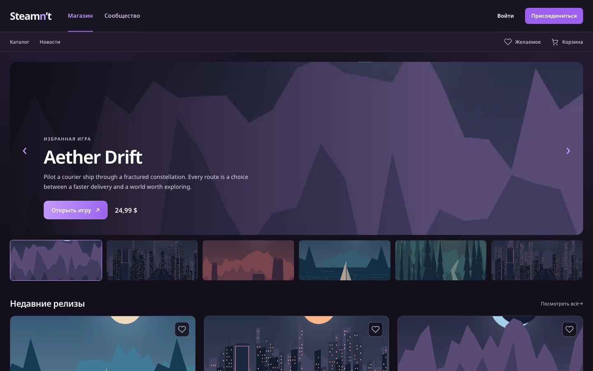
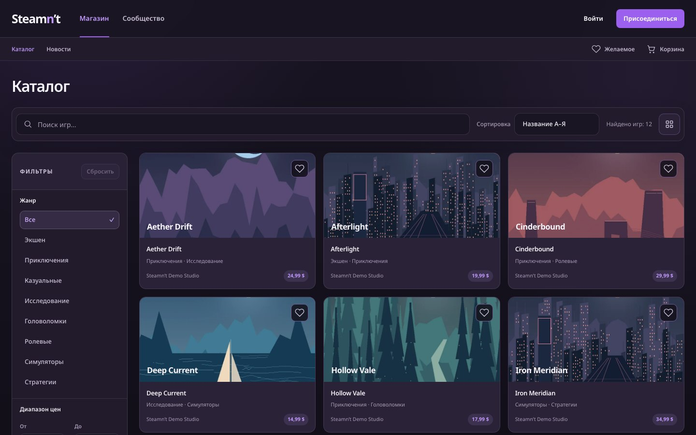
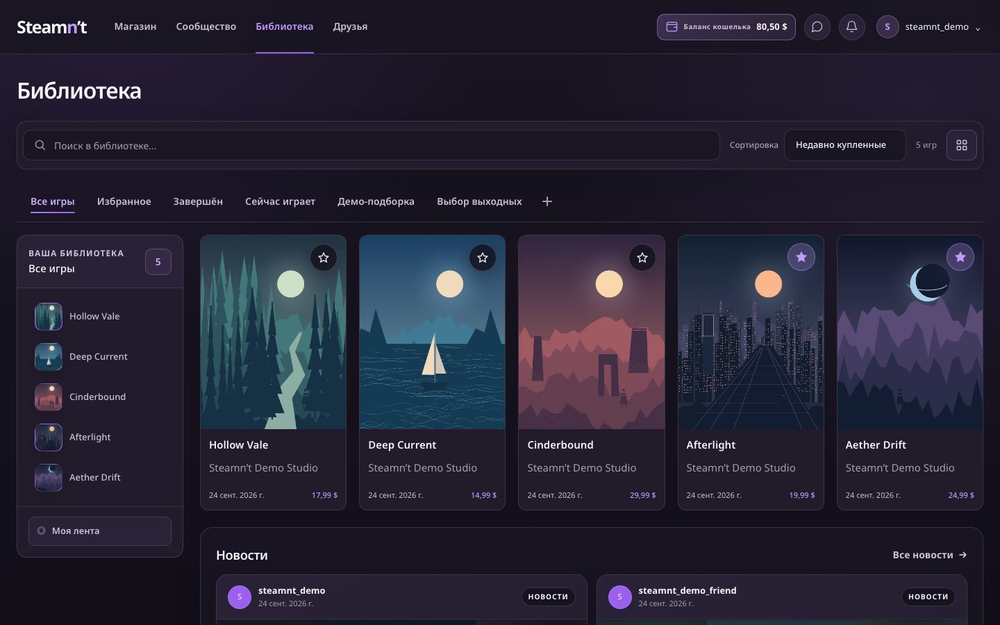
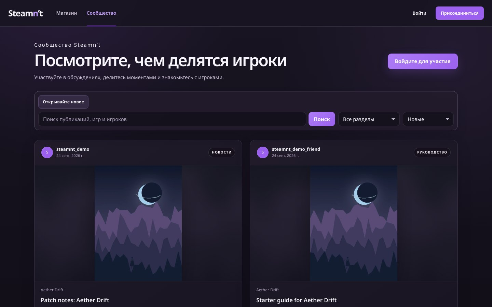
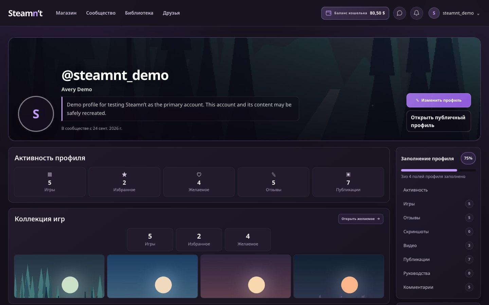
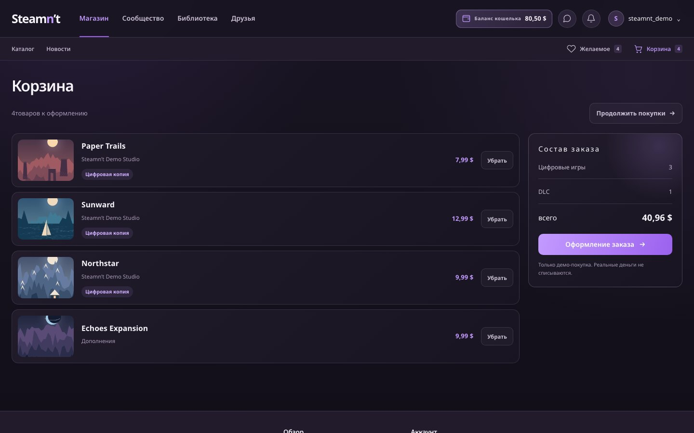
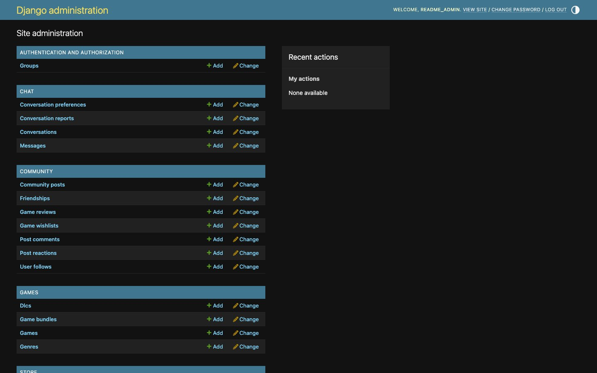
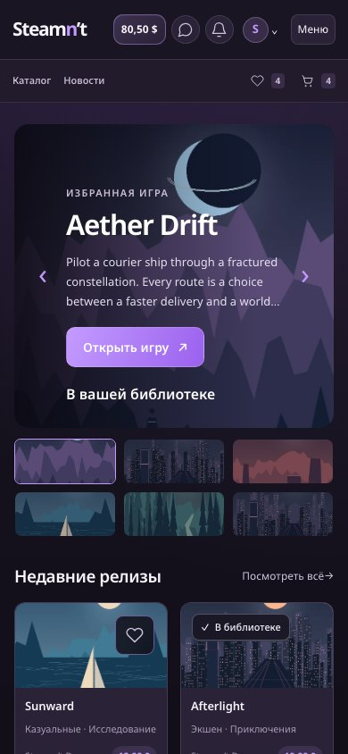
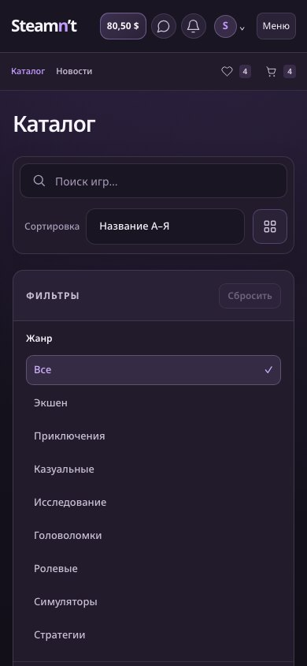
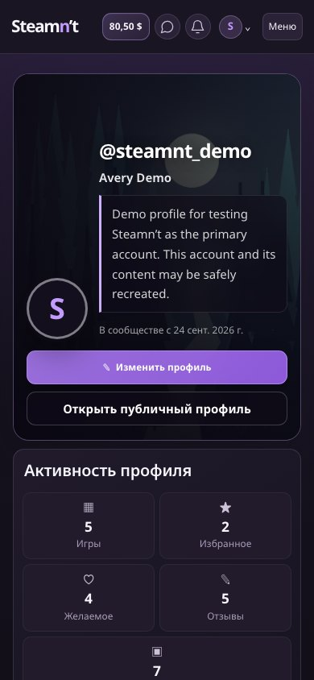

# Steamn’t

**Магазин игр, библиотека и сообщество в одном локальном проекте.** Можно изучить каталог, пройти демонстрационную покупку, собрать библиотеку, общаться с друзьями и управлять содержимым через Django admin.

> Это учебный демо-сервис. Оплата и кошелёк имитируются; реальные деньги не списываются, коммерческие лицензии и игровые файлы не предоставляются.



[Быстрый запуск](#быстрый-запуск) · [Демо-доступ](#демо-доступ) · [Админка](#админка) · [Скриншоты](#скриншоты) · [Проверка](#проверка-проекта) · [Помощь](#если-что-то-не-открылось)

## Что внутри

| Раздел | Возможности |
| --- | --- |
| Магазин | Каталог с поиском, фильтрами и сортировкой; страницы игр, DLC и наборов; избранное, корзина и демо-оформление заказа. |
| Библиотека | Купленные игры и дополнения, коллекции, избранное, отзывы, лента и новости. |
| Сообщество | Публикации, изображения и видео, комментарии, реакции, публичные профили, подписки и друзья. |
| Общение | Чат с вложениями, уведомления, запросы дружбы, блокировки и жалобы. |
| Аккаунт | Профиль, приватность, темы, язык интерфейса, история заказов и операций демо-кошелька. |
| Управление | Django admin для пользователей, каталога, публикаций и других моделей; финансовые журналы доступны только для чтения. |

## Быстрый запуск

Нужен запущенный **Docker Desktop**. Команды выполняются **в терминале уже открытой папки проекта** — там, где лежит `docker-compose.yml`. Архив дополнительно распаковывать не нужно, если проект уже открыт.

**macOS / Linux** — нужен Python 3 для первоначального создания `.env`:

```bash
sh setup-local.sh
docker compose config --quiet
docker compose up --build -d --wait
docker compose exec -T backend python manage.py seed_full_demo
```

**Windows PowerShell**:

```powershell
./setup-local.ps1
docker compose config --quiet
docker compose up --build -d --wait
docker compose exec -T backend python manage.py seed_full_demo
```

Если PowerShell запрещает запуск локального сценария, выполните один раз в **этом окне** `Set-ExecutionPolicy -Scope Process Bypass`, затем повторите `./setup-local.ps1`.

Откройте [сайт](http://localhost:5180), [API](http://localhost:8010/api/health/) или [админку](http://localhost:5180/admin/). Команда подготовки создаёт `.env` со случайными локальными секретами и **не перезаписывает существующий** файл. `seed_full_demo` добавляет повторяемые тестовые данные во все основные разделы. Не запускайте её на базе с реальными пользовательскими данными: она синхронизирует заранее определённые демо-аккаунты и их пароли.

Обычная остановка и последующий запуск сохраняют базу и загруженные файлы:

```bash
docker compose stop
docker compose up -d --wait
```

Не используйте `docker compose down -v`, если хотите сохранить данные. Для нового кода достаточно `docker compose up --build -d --wait`; команда не удаляет тома.

## Демо-доступ

После `seed_full_demo` основной аккаунт:

| Поле | Значение |
| --- | --- |
| Email для входа на сайт | `steamnt-demo@example.invalid` |
| Пароль | `SteamntDemo2026!` |
| Имя пользователя | `steamnt_demo` |

Команда создаёт ещё четыре демо-профиля с тем же паролем для проверки друзей, подписок и чата. Список аккаунтов печатается после выполнения команды. Этот пароль предназначен **только для локальной демонстрации**. Если вы передали `seed_full_demo --password '...'`, используйте выбранный пароль и для сайта, и для генератора скриншотов.

## Админка

Создайте отдельного администратора. Команда попросит **имя пользователя**, email и пароль:

```bash
docker compose exec backend python manage.py createsuperuser
```

Затем откройте [http://localhost:5180/admin/](http://localhost:5180/admin/) и в поле **Username** введите именно имя пользователя, созданное этой командой, а не пароль и не email. Пароль вводится в отдельное поле **Password**. Демо-аккаунт `steamnt_demo` сам по себе не является администратором.

В админке можно смотреть и редактировать пользователей, игры, DLC, наборы, публикации, уведомления и другие записи. Заказы, элементы приобретения, владение в библиотеке и операции кошелька представлены как журналы **только для чтения**: покупки и возвраты следует делать через сайт, чтобы сохранялась целостность баланса.

## Скриншоты

В архиве уже есть **41 снимок** в [`docs/screenshots/`](docs/screenshots/README.md): настольные страницы, три мобильных состояния и семь экранов админки. Все имена стабильны (`01-home.jpg`, `22-cart.jpg`, `35-admin-dashboard.jpg` и так далее), а [`manifest.json`](docs/screenshots/manifest.json) связывает файл с маршрутом и размером экрана.

| Каталог | Библиотека |
| --- | --- |
|  |  |

| Сообщество | Личный профиль |
| --- | --- |
|  |  |

| Корзина | Администрирование |
| --- | --- |
|  |  |

<details>
<summary>Мобильная версия</summary>

| Главная | Каталог | Профиль |
| --- | --- | --- |
|  |  |  |

</details>

### Переснять проект одной командой

Сначала запустите сайт и заполните демо-данные по инструкции выше. Затем установите инструмент снимков (нужен **Node.js 20+**):

```bash
cd scripts
npm ci
npx playwright install chromium
npm run capture
```

На Windows PowerShell команды такие же. По умолчанию генератор открывает `http://localhost:5180/`, входит под демо-аккаунтом и переснимает **34 экрана**. Он не делает покупок и публикаций, но вход и просмотр чата могут обновить служебные отметки; запускайте его на отдельной демо-базе. Результат сохраняется в `docs/screenshots/`, включая `manifest.json`. Уже существующие файлы с другими именами он не удаляет.

Чтобы включить **семь экранов админки**, перед запуском задайте её учётные данные в текущем терминале. Пароль не записывается в проект и не попадает в `manifest.json`:

```bash
export STEAMNT_ADMIN_USER='имя_администратора'
export STEAMNT_ADMIN_PASSWORD='ваш_пароль'
npm run capture
```

PowerShell:

```powershell
$env:STEAMNT_ADMIN_USER = 'имя_администратора'
$env:STEAMNT_ADMIN_PASSWORD = 'ваш_пароль'
npm run capture
```

Другой адрес сайта задаётся через `STEAMNT_BASE_URL`; отдельный адрес админки при разработке через Vite — через `STEAMNT_ADMIN_BASE_URL`. Для нестандартного пароля демо-аккаунта используйте `STEAMNT_DEMO_EMAIL` и `STEAMNT_DEMO_PASSWORD`; для языка — `STEAMNT_SCREENSHOT_LOCALE=ru|uk|en`. Скрипт выбирает ID игр, заказов и публикаций через API, поэтому не зависит от фиксированных ID в базе. **Не публикуйте переснятые изображения из установки с настоящими пользователями**: экраны админки и профиля могут содержать персональные данные.

## Проверка проекта

После запуска проверьте путь: каталог → игра → корзина → оформление → заказ → библиотека. Затем откройте профиль, сообщество, друзей, чат, уведомления и настройки. Для админки проверьте вход и списки пользователей, игр, заказов и операций кошелька.

Автоматические проверки:

```bash
docker compose exec -T backend python manage.py check
docker compose exec -T backend python manage.py migrate --check
docker compose exec -T backend python manage.py makemigrations --check --dry-run
docker compose exec -T backend python manage.py test --noinput
```

Для frontend из корня проекта:

```bash
cd frontend
npm ci
npm run lint
npm test
npm run build
```

Документы для глубокой приёмки: [`RELEASE_QA.md`](docs/RELEASE_QA.md), [`DESIGN_QA.md`](docs/DESIGN_QA.md), [`MANUAL_QA.md`](docs/MANUAL_QA.md) и [описание API](docs/API.md). Исторический план работ — [`PROJECT_ROADMAP.md`](PROJECT_ROADMAP.md); открытые пункты в нём не следует считать автоматически выполненными.

## Устройство проекта

```text
backend/             Django, REST API, модели, миграции, админка, демо-данные
frontend/            React 19, React Router, Vite, интерфейс и тесты
docs/                Документация и screenshots/ с галереей
scripts/             Генератор скриншотов на Playwright
docker-compose.yml   PostgreSQL + backend + frontend
setup-local.*         Безопасное создание локального .env
```

В Docker используются PostgreSQL 16, Django 6.1/DRF 3.18, Gunicorn и Nginx. База, публичные медиа и приватные вложения хранятся в отдельных постоянных томах. Интерфейс доступен на порту `5180`, backend — `8010`; их можно изменить в `.env`. PostgreSQL наружу в основном Compose-файле не опубликован.

## Если что-то не открылось

```bash
docker compose ps
docker compose logs --tail=100 backend
docker compose logs --tail=100 frontend
```

- **`localhost:5180` не отвечает:** убедитесь, что Docker Desktop запущен, а `docker compose ps` показывает здоровые backend и frontend. После ошибок запуска посмотрите журналы выше.
- **Порт занят:** измените `FRONTEND_PORT` или `BACKEND_PORT` в `.env`, затем выполните `docker compose up -d --wait`. Откройте новый адрес frontend.
- **Не входит демо-аккаунт:** проверьте, что выполнена `seed_full_demo`, и используйте email для сайта. Если указан `--password`, стандартный демо-пароль уже не подходит.
- **Не входит администратор:** в форме Django нужен `Username`, заданный при `createsuperuser`. Существующий демо-пользователь не получает права staff автоматически.
- **Не стартует генератор снимков:** проверьте сайт и API, `npm ci`, `npx playwright install chromium`, а затем текст ошибки в терминале. Скрипт сообщает, если не хватает демо-данных или неверны учётные данные.

Восстановление пароля в локальном режиме выводит ссылку в `docker compose logs backend`; SMTP-доставка во внешний сервис требует отдельной настройки `.env` и здесь не заявляется как проверенная. Перед переносом существующей установки обязательно сохраните базу и оба тома медиа.
